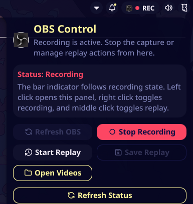
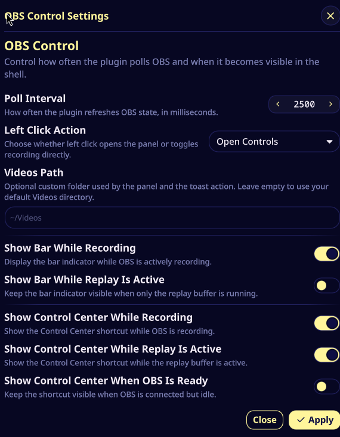

MOVED TO https://github.com/noctalia-dev/noctalia-plugins/tree/main/obs-control

# OBS Control for Noctalia

OBS Studio controls for Noctalia with:

- a bar indicator while recording
- a Control Center shortcut when OBS is active
- a panel with record and replay actions
- configurable polling, visibility, click behavior, and videos path
- native Noctalia toast actions for opening the videos folder after saves
- official Noctalia IPC commands for compositor keybinds and external triggers

## Features

- left click can open the control panel or toggle recording
- right click toggles recording
- middle click toggles the replay buffer
- panel includes quick access to the videos folder
- toast action opens the configured videos folder after saves

## Dependencies

- `obs-studio`
- OBS WebSocket enabled in OBS
- `node` available in `PATH`
- a Node.js runtime with built-in `WebSocket` support, such as current Node.js releases

This plugin uses the Noctalia-recommended plugin IPC path for external actions:

```bash
qs -c noctalia-shell ipc call plugin:obs-control toggleRecord
```

`run-action` is still shipped as a convenience wrapper around that official IPC command flow.

## Installation

### Custom repository install
1. Navigate to the Noctalia settings plugins section

2. Open the sources sub-menu

3. Add Obs Control as a custom repository
```bash
https://github.com/ayagmar/noctalia-obs-control.git
```

4. Navigate back to Available plugins and search for Obs Control

5. Click install button

Enable it in Noctalia and add `plugin:obs-control` to your bar or Control Center layout.

### Planned main-registry submission

This repository is structured to be submit-ready for the official `noctalia-plugins` registry. Until that PR is merged, install it through the custom repository flow above.

## Hotkey examples

Use Noctalia IPC directly from your compositor:

```bash
qs -c noctalia-shell ipc call plugin:obs-control togglePanel
qs -c noctalia-shell ipc call plugin:obs-control toggleRecord
qs -c noctalia-shell ipc call plugin:obs-control toggleReplay
qs -c noctalia-shell ipc call plugin:obs-control saveReplay
```

You can also use the plugin’s installed `scripts/run-action` wrapper if you prefer not to write the `qs` command directly.

## Troubleshooting

- If OBS is running but the plugin says WebSocket control is unavailable, restart OBS once after enabling the obs-websocket plugin.
- If actions do nothing, verify `qs -c noctalia-shell ipc call plugin:obs-control refreshStatus` works from a terminal in your session.
- If the helper wrapper fails, confirm `qs` is in `PATH`. If the plugin itself fails, confirm `node` is in `PATH` and your runtime provides the global `WebSocket` API.

## Screenshots

Registry preview:



Plugin settings:


